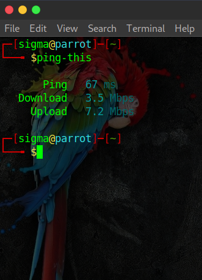

# <center> Internet Speed Test Console (ping-this) </center>


## Install
```npm install ping-this```

## Usage
```ping-this```

## GET
  1. Ping Speed
  2. Download Speed
  3. Upload Speed

<center>  </center>